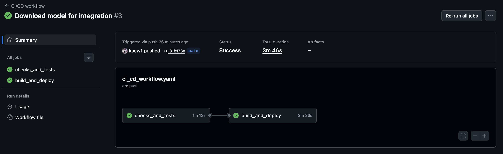
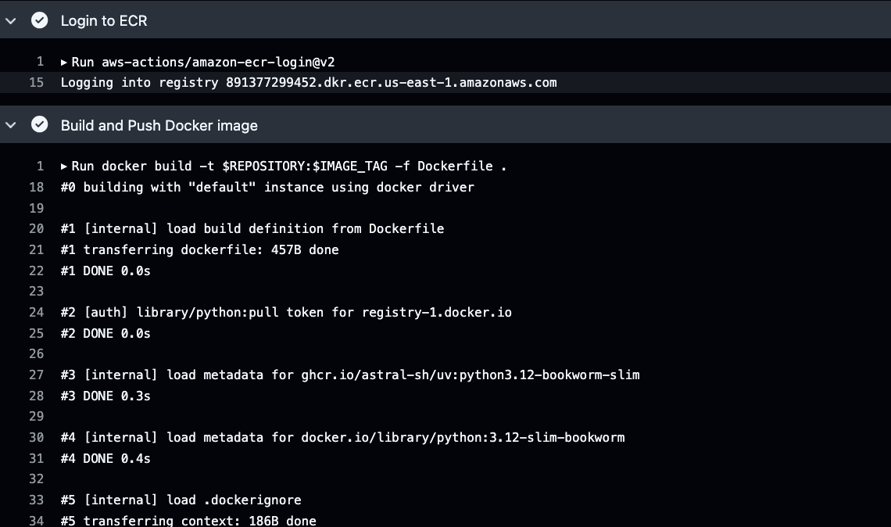
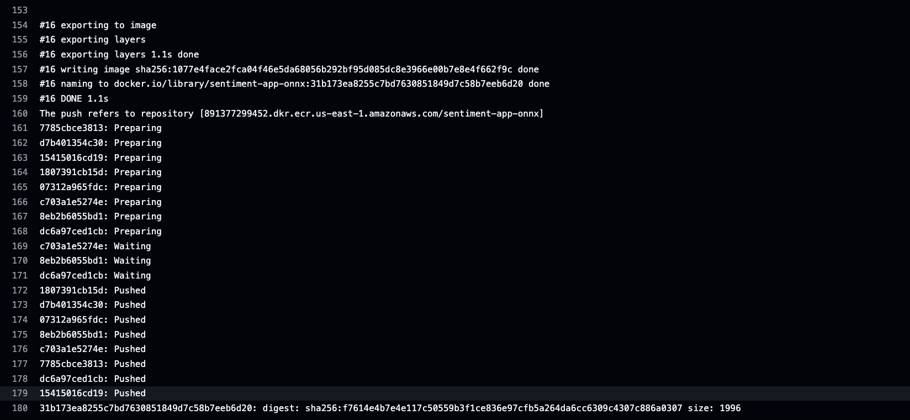
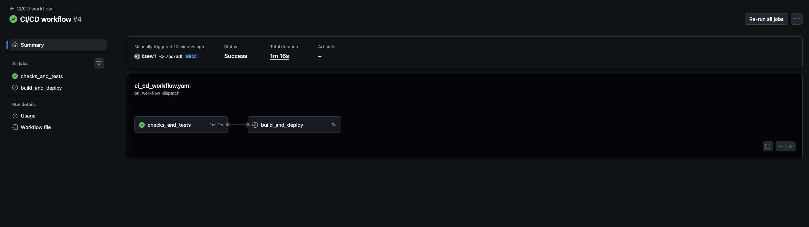
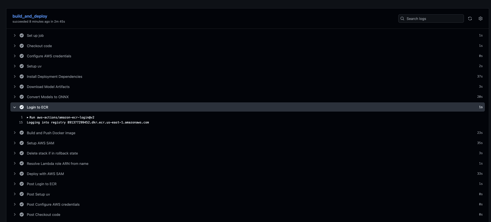
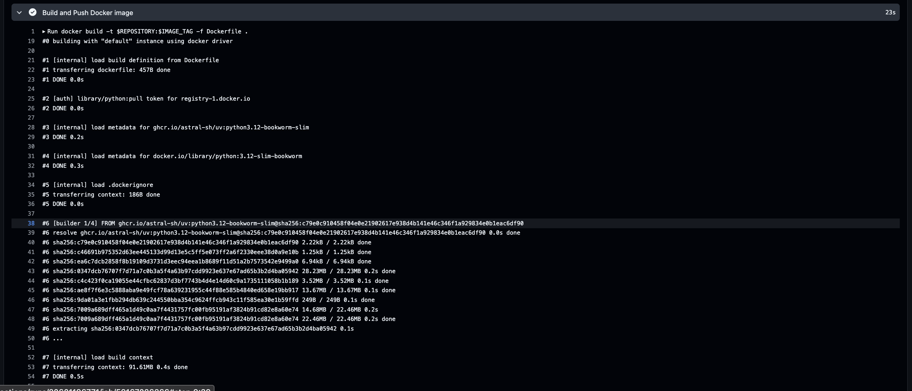
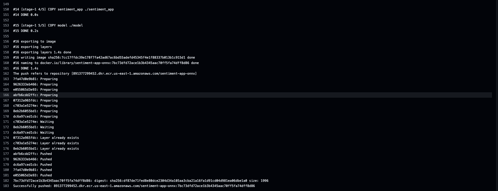
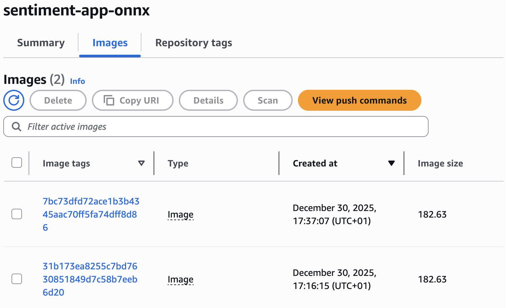
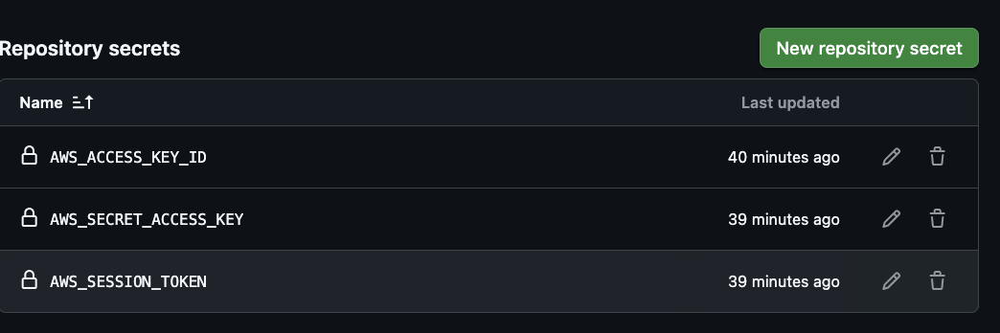

## Hello word action

[Link](https://github.com/ksew1/ml-ops-course-lab11-lab/actions/runs/20597701026)

## Lab action

## Homework action

### Exercise 1

#### Input integration

[Link](https://github.com/ksew1/ml-ops-course-lab11-lab/actions/runs/20601167410)

#### Input All

[Link](https://github.com/ksew1/ml-ops-course-lab11-lab/actions/runs/20601196771)

### Exercise 2

[Link](https://github.com/ksew1/ml-ops-course-lab11-lab/actions/runs/20601196771)

#### Login to ERC

#### Docker Push

### Secret setup

